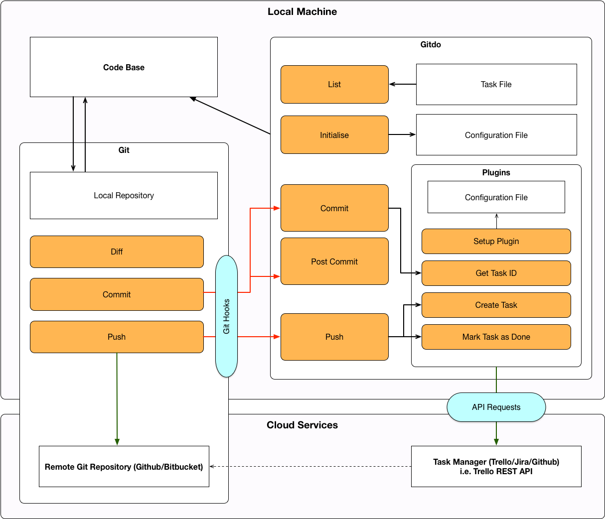
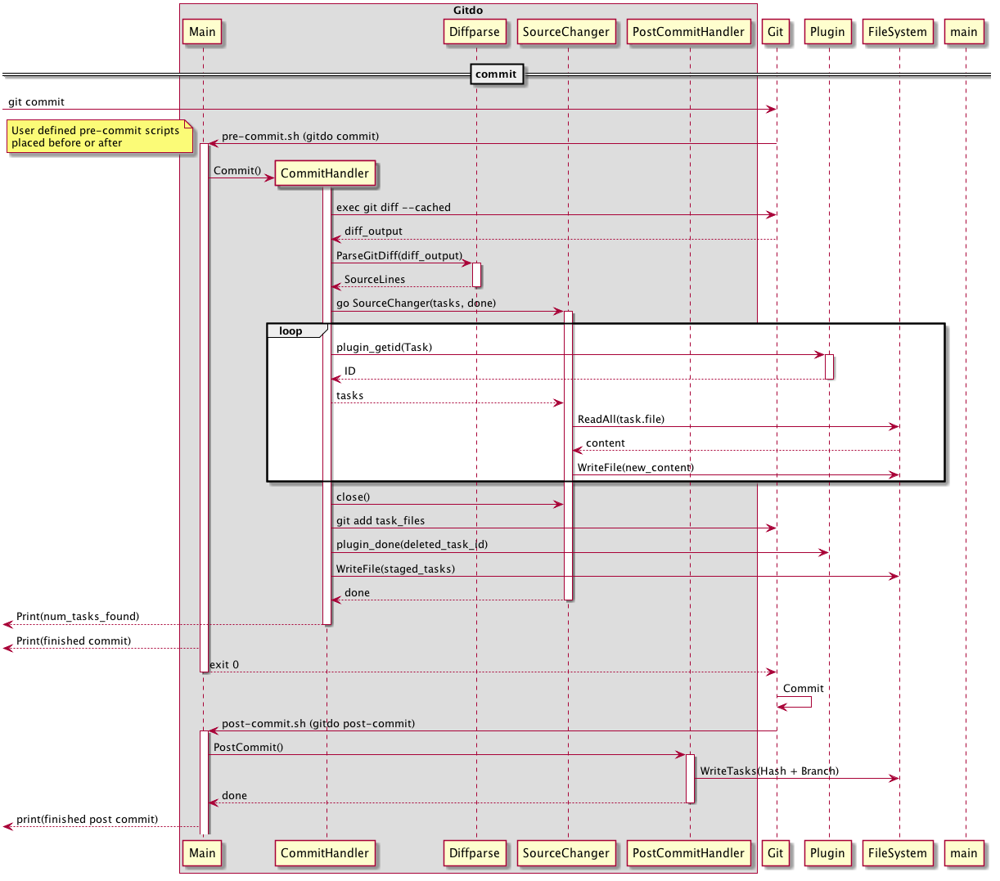

Welcome to the Gitdo wiki!

Gitdo is a project aimed at keeping track of TODO comments in a development team.
It is being developed by a student of Bournemouth University as part of a dissertation.
The road map can be found [on Trello](https://trello.com/b/NlUXGlG6/gitdo-development).

### Architecture

### Sequence Diagrams

