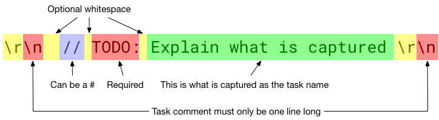

1. Verify your install by running `gitdo --version`
1. Navigate to the directory you would like to use the tool on with `cd path/to/project`
1. Ensure it is a Git directory by running `git status` - if not initialise with `git init`
1. Run `gitdo init` to start the configuration
1. Gitdo will print the email associated with your git - `git config user.email`
1. Choose a plugin from the list given. [more info](#plugins)
1. Type the plugin interpreter. [more info](#interpreter)
1. Follow the plugins set up function instructions. Any configuration it asks for should be save inside the `.git/gitdo/plugins/{plugin name}/` directory.
1. To make changes to the configuration you can either run the `gitdo init` command again (recommended), or edit the configuration files in `.git/gitdo`

#### What is captured?

At the moment Gitdo supports
* Single line comments only
* Comments that start `#` or `//`
* The keyword `TODO:` (note the colon)

Only `TODO:` is captured to allow developers to use other keywords freely, e.g. you could use `BUG #381` to reference an task that was captured outside of Gitdo.

Requiring a colon (most of the time) stops the auto generated TODO comments that IDEs insert being captured. Eclipse will create a comment of `// TODO Auto-generated method stub`, for example, and having an overwhelming number of 'Auto-generated method stub' cards in Trello is probably not very helpful.

#### Plugins
A plugin for Gitdo is a set of functions `setup`, `getid`, `create` and `done`. They are given tasks and ID's and act on the API of whichever task manager they are for. They are located in either
```
~/.gitdo/plugins
```
on MacOS and Linux, or
```
%UserProfile%\AppData\Roaming\Gitdo\plugins
```
on Windows.

You can create a new one by adding a new directory with the name of your plugin. An example would be to reinstall the Trello plugin by running
```
# Windows
cd %UserProfile%\AppData\Roaming\Gitdo\plugins

# Mac/Linux
cd ~/.gitdo

git clone https://github.com/nebloc/Trello-GitdoPlugin.git Trello
```
*Gitdo currently does not verify that a plugin is working, or even that it has all of the functions. It will run the setup function when you have ran `gitdo init` giving some indication that the interpreter is correct, but plugin maintenance is not in scope.*

#### gitdo init
The command `gitdo init` will create a folder inside the Git repository for that project (`./.git/gitdo`) where it will store configuration and tasks.
It will also copy the Git hook scripts, located in `~/.gitdo/hooks` or `%AppData%\Gitdo\hooks`, to the `./.git/hooks` directory, so that they will be executed by Git.

#### Interpreter
This is what scripting language and command you need for the plugin. The example Trello plugin bundled with Gitdo needs Python 3 (you can check the version with `python -V`) so you would type `python` or `python3` as the interpreter.

This isn't always Python 3, an example of one that uses something else is the (macOS only) [Omnifocus plugin](https://github.com/nebloc/Omnifocus-GitdoPlugin) that uses a javascript variant of AppleScript, and would need `osascript -l JavaScript`

#### Eclipse
Eclipse IDE seems to ignore what is in the users path, and so to get it to work with the Eclipse Git interface, locations of Gitdo and the interpreter need to be explicit.
Therefore, the hooks need to be changed
```
# From
gitdo commit -c

# To
/usr/local/bin/gitdo commit -c
```
and when prompted for the interpreter in the `gitdo init` function
```
# Don't use shorthand like
python3

# Type the path of the executable, e.g.
/usr/local/Cellar/python3/3.6.5/bin/python3.6
```
